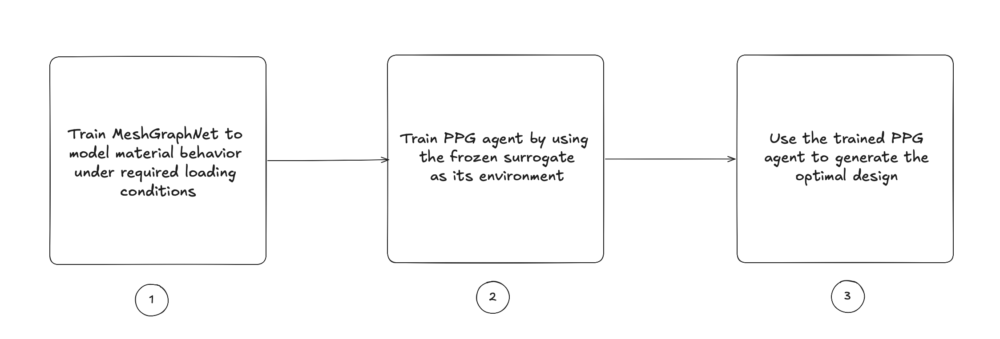
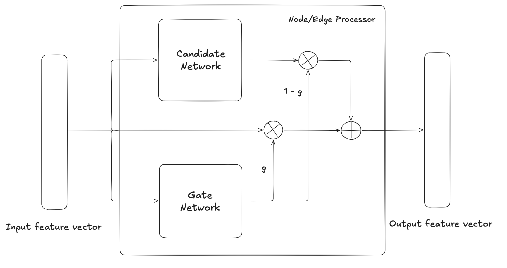
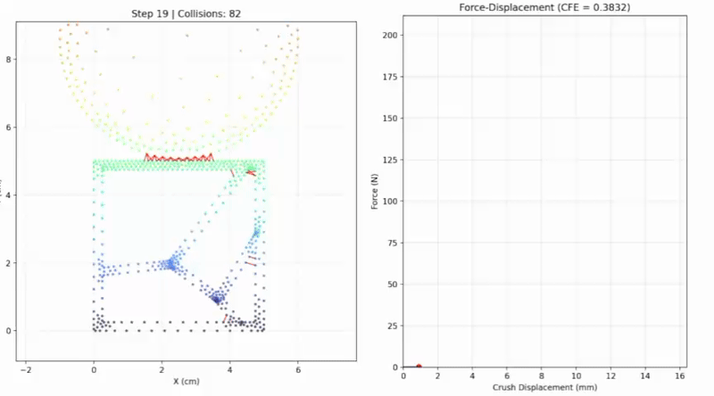
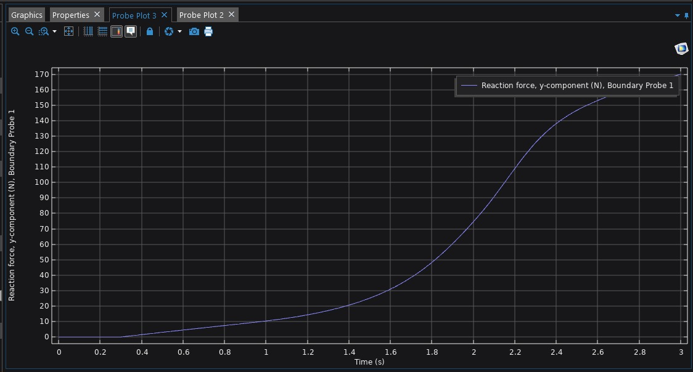
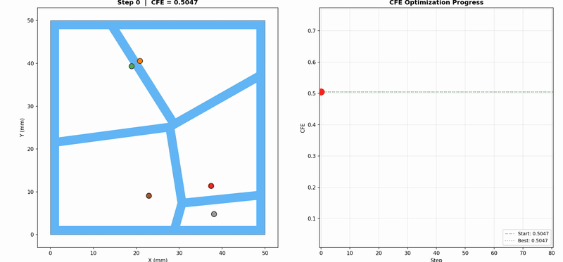
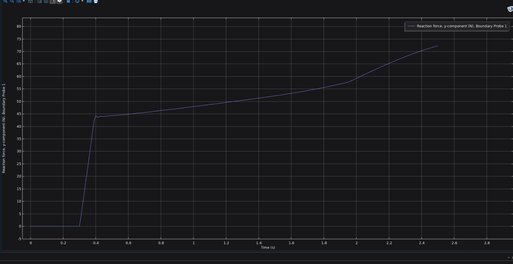

# NeuralCrush

A two-stage framework for **learning** and **optimizing** crashworthiness structures on discretized domains. A graph neural network surrogate replaces finite element simulation, then a reinforcement learning agent optimizes structural geometry against the learned physics — achieving design iteration in seconds instead of hours.

> **Status**: Active research. Currently supports 2D quasistatic crush with Voronoi-parameterized TPU absorbers. Future work targets 3D domains, multi-material systems, and physics-constrained energy conservation.

<!-- Placeholder: add your results GIF/image here -->
<!--  -->

---

## Table of Contents

- [Overview](#overview)
- [Stage 1 — MeshGraphNet Surrogate](#stage-1--meshgraphnet-surrogate)
  - [Architecture](#architecture)
  - [Gated Message Passing](#gated-message-passing)
  - [Edge Feature Construction](#edge-feature-construction)
  - [Loss Function](#loss-function)
- [Stage 2 — Phasic Policy Gradient Optimization](#stage-2--phasic-policy-gradient-optimization)
  - [Problem Formulation](#problem-formulation)
  - [Squashed Gaussian Policy](#squashed-gaussian-policy)
  - [GAE and Returns](#gae-and-returns)
  - [Phasic Update](#phasic-update)
- [Material Model](#material-model)
- [Data Format](#data-format)
  - [Per-Frame .pt Dictionary](#per-frame-pt-dictionary)
  - [Raw FEA Input Format](#raw-fea-input-format)
  - [Preprocessing Pipeline](#preprocessing-pipeline)
  - [File Naming & Splits](#file-naming--splits)
- [Results](#results)
- [Project Structure](#project-structure)
- [Installation & Usage](#installation--usage)
- [Future Work](#future-work)
- [License](#license)
- [Citation](#citation)

---

## Overview

Designing crash-absorbing structures traditionally requires running expensive finite element simulations for every candidate geometry. This project replaces that bottleneck with a two-stage pipeline:

**Stage 1** trains a MeshGraphNet (MGN) to predict per-node accelerations from the current mesh state. Once trained, the surrogate runs ~1000× faster than FEA while preserving the force-displacement behavior needed for engineering metrics.

**Stage 2** freezes the surrogate and wraps it as a gym-like environment. A Phasic Policy Gradient (PPG) agent takes sequential actions to move Voronoi seed points that define a structure's internal geometry, maximizing Crush Force Efficiency (CFE) — the ratio of mean to peak force during crush.

<p align="center">
  
</p>

---

## Stage 1 — MeshGraphNet Surrogate

### Architecture

The model operates on a heterogeneous graph with two edge types:

- **Mesh edges** $\mathcal{E}_M$: structural connectivity from the finite element mesh
- **World edges** $\mathcal{E}_W$: dynamically constructed contact edges between surfaces within radius $r$, filtered by surface normals to detect opposing faces

Each node $i$ is encoded with velocity history, inverse mass, and type flags:

$$\mathbf{x}_i^0 = \text{MLP}_{\text{enc}}\left(\left[\ \mathbf{v}_i^{t-1},\ \mathbf{v}_i^{t},\ m_i^{-1},\ \mathbf{f}_i\ \right]\right)$$

where $\mathbf{f}_i \in \{0,1\}^3$ encodes `[is_impactor, is_absorber, is_fixed]`.

The network consists of $L = 15$ stacked interaction blocks followed by a decoder MLP that outputs predicted acceleration $\hat{\mathbf{a}}_i \in \mathbb{R}^2$.

### Gated Message Passing

Standard message passing in deep GNNs suffers from over-smoothing — after many layers, edge and node features converge to indistinguishable vectors. This implementation uses **gated updates** on all three processors (mesh edges, world edges, nodes) to control information flow.

For each processor, a GatedMLP computes a candidate update and a mixing gate in parallel:

$$\mathbf{c} = \text{MLP}\_{\text{update}}(\mathbf{x}\_{\text{in}}), \quad g = \sigma\left(\text{MLP}\_{\text{gate}}(\mathbf{x}\_{\text{in}})\right)$$

The new state blends the old state with the candidate:

$$\mathbf{h}^{\ell+1} = (1 - g) \odot \mathbf{h}^{\ell} + g \odot \mathbf{c}$$

The gate bias is initialized to $-2.0$, so $\sigma(-2) \approx 0.12$ — the network starts near-identity and learns when to deviate. This gives the network 15 layers of depth without the representational collapse that would occur with standard residual connections.

**Within each interaction block**, the update order is:

1. **Mesh edge update**: $\mathbf{e}\_{ij}^{\ell+1} = \text{GatedMLP}\_M\left(\left[\mathbf{x}\_i^\ell,\ \mathbf{x}\_j^\ell,\ \mathbf{e}\_{ij}^\ell\right]\right)$
2. **World edge update**: $\mathbf{e}\_{ij}^{\ell+1} = \text{GatedMLP}\_W\left(\left[\mathbf{x}\_i^\ell,\ \mathbf{x}\_j^\ell,\ \mathbf{e}\_{ij}^\ell\right]\right)$
3. **Aggregation**: $\mathbf{m}\_i^M = \sum\_{j \in \mathcal{N}\_M(i)} \mathbf{e}\_{ij}^{\ell+1}$, $\quad \mathbf{m}\_i^W = \sum\_{j \in \mathcal{N}\_W(i)} \mathbf{e}\_{ij}^{\ell+1}$
4. **Node update**: $\mathbf{x}\_i^{\ell+1} = \text{GatedMLP}\_N\left(\left[\mathbf{x}\_i^\ell,\ \mathbf{m}\_i^M,\ \mathbf{m}\_i^W\right]\right)$

<p align="center">
  
</p>
<p align="center"><em>Gated update block. The gate network controls how much of the candidate update is mixed into the previous state, preventing over-smoothing across 15 message-passing layers.</em></p>

### Edge Feature Construction

**Mesh edges** encode both geometric and kinematic information:

$$\mathbf{e}_{ij}^M = \left[\ \underbrace{\mathbf{p}_i - \mathbf{p}_j}_{\text{rel. position}},\ \underbrace{\boldsymbol{\varepsilon}\_{ij}}_{\text{strain vector}},\ \underbrace{\mathbf{v}_i - \mathbf{v}_j}_{\text{rel. velocity}},\ \underbrace{\lVert\mathbf{p}_i - \mathbf{p}_j\rVert}_{\text{curr. dist.}},\ \underbrace{\lVert\mathbf{p}_i^0 - \mathbf{p}_j^0\rVert}_{\text{ref. dist.}}\ \right]$$

where the strain vector captures both magnitude and direction of deformation:

$$\boldsymbol{\varepsilon}\_{ij} = \frac{\lVert\mathbf{p}_i - \mathbf{p}_j\rVert - \lVert\mathbf{p}_i^0 - \mathbf{p}_j^0\rVert}{\lVert\mathbf{p}_i^0 - \mathbf{p}_j^0\rVert + \epsilon} \cdot \frac{\mathbf{p}_i - \mathbf{p}_j}{\lVert\mathbf{p}_i - \mathbf{p}_j\rVert + \epsilon}$$

**World edges** encode contact proximity:

$$\mathbf{e}_{ij}^W = \left[\ \mathbf{p}_i - \mathbf{p}_j,\ \mathbf{v}_i - \mathbf{v}_j\ \right]$$

All edge features are z-score normalized with running statistics.

### Loss Function

The loss combines node-level and edge-level MAE terms. Let $\hat{\mathbf{a}}_i$ be the predicted (normalized) acceleration and $\mathbf{a}_i$ the ground truth after normalization. Impactor and fixed nodes are excluded.

**Node loss:**

$$\mathcal{L}\_{\text{node}} = \lvert\hat{\mathbf{a}}\_i - \mathbf{a}\_i\rvert$$

**Structural loss** — penalizes inconsistency of *relative* predictions across edges:

$$\mathcal{L}\_{\text{mesh},i} = \frac{1}{2}\sum\_{j \in \mathcal{N}\_M(i)} \left\lvert(\hat{\mathbf{a}}\_i - \hat{\mathbf{a}}\_j) - (\mathbf{a}\_i - \mathbf{a}\_j)\right\rvert$$

$$\mathcal{L}\_{\text{world},i} = \frac{1}{2}\sum\_{j \in \mathcal{N}\_W(i)} \left\lvert(\hat{\mathbf{a}}\_i - \hat{\mathbf{a}}\_j) - (\mathbf{a}\_i - \mathbf{a}\_j)\right\rvert$$

**Combined:**

$$\mathcal{L} = \frac{1}{\lvert\mathcal{A}\rvert}\sum_{i \in \mathcal{A}} \left(\mathcal{L}_{\text{node},i} + 0.5\,\mathcal{L}_{\text{mesh},i} + 0.5\,\mathcal{L}_{\text{world},i}\right)$$

where $\mathcal{A}$ is the set of active (non-fixed, non-impactor) nodes. During training, a **node-level loss mask** further subsamples: all high-acceleration nodes are included, plus a random subset of quiet nodes — focusing gradient signal on the sparse, bursty events that dominate quasistatic crush.

An optional **element-based Ogden physics loss** (see [Material Model](#material-model)) distributes strain energy error from each triangle back to its vertices proportionally to their kinematic tracking error.

---

## Stage 2 — Phasic Policy Gradient Optimization

### Problem Formulation

The agent controls the 2D positions of $K$ Voronoi seed points that define a crush structure's internal geometry. At each episode step $t$, the agent observes:

$$\mathbf{s}_t = \left[\ \underbrace{\tilde{\mathbf{p}}_1, \ldots, \tilde{\mathbf{p}}_K}_{\text{normalized coords}},\ \underbrace{\mathbf{T}(\mathbf{p})}_{\text{Voronoi topology}},\ \underbrace{\text{CFE}_t}_{\text{current score}}\ \right]$$

The topology feature $\mathbf{T}$ encodes per-seed-pair geometric relationships extracted from the Voronoi diagram: $[\lvert dx\rvert/B,\ \lvert dy\rvert/B,\ \ell_{\text{edge}}/B]$ for neighboring pairs (zero for non-neighbors), where $B$ is the box size. This is flattened to a $K^2 \times 3$ vector.

The action $\mathbf{a}_t \in \mathbb{R}^{2K}$ is a displacement applied to each seed. The reward is the change in CFE:

$$r_t = \text{CFE}(\mathbf{p}_{t+1}) - \text{CFE}(\mathbf{p}_t)$$

If meshing fails (invalid geometry), the episode terminates with a penalty $r_t = -1.0$.

### Squashed Gaussian Policy

The policy outputs a diagonal Gaussian in an unbounded space, then squashes via $\tanh$ to enforce hard action bounds $[-a_{\max}, a_{\max}]$:

$$\boldsymbol{\mu}, \boldsymbol{\sigma} = \pi_\theta(\mathbf{s}), \quad u \sim \mathcal{N}(\boldsymbol{\mu}, \boldsymbol{\sigma}^2), \quad \mathbf{a} = \tanh(u) \cdot a_{\max}$$

The log-probability must account for the change-of-variables Jacobian. For a scalar action dimension $d$:

$$\log \pi_\theta(a_d \mid \mathbf{s}) = \log \mathcal{N}(u_d \mid \mu_d, \sigma_d^2) - \log\left(1 - \tanh^2(u_d)\right) - \log(a_{\max})$$

The first correction comes from the derivative of $\tanh$:

$$\frac{da}{du} = (1 - \tanh^2(u)) \cdot a_{\max} \quad \Longrightarrow \quad \log\left\lvert\frac{da}{du}\right\rvert = \log(1 - \tanh^2(u)) + \log(a_{\max})$$

Since we need $\log \pi(a) = \log \pi(u) - \log\lvert da/du\rvert$, we subtract both terms. The full multi-dimensional log-probability is:

$$\log \pi_\theta(\mathbf{a} \mid \mathbf{s}) = \sum_{d=1}^{2K} \left[\log \mathcal{N}(u_d \mid \mu_d, \sigma_d^2) - \log(1 - \tanh^2(u_d)) - \log(a_{\max})\right]$$

When re-evaluating a stored action during the PPO update, the raw Gaussian sample is recovered via $u = \text{atanh}(\mathbf{a} / a_{\max})$.

### GAE and Returns

Advantages are computed via Generalized Advantage Estimation over the episode:

$$\delta_t = r_t + \gamma\(1 - d_t) V_\phi(\mathbf{s}_{t+1}) - V_\phi(\mathbf{s}_t)$$

$$\hat{A}_t = \sum_{k=0}^{T-t-1} (\gamma \lambda)^k \(1 - d_{t+k})\ \delta_{t+k}$$

implemented as the backward recursion:

$$\hat{A}_t = \delta_t + \gamma \lambda \(1 - d_t)\ \hat{A}_{t+1}$$

Returns for the value function target:

$$G_t = \hat{A}_t + V_\phi(\mathbf{s}_t)$$

### Phasic Update

Standard PPO trains the policy and value function simultaneously, which means the policy's advantage estimates are computed against a value function that's still changing underneath it. This implementation separates them into phases:

**Phase 1 — Critic fitting** (16 epochs): Fit $V_\phi$ to the GAE returns using clipped Smooth-L1 loss:

$$V_{\text{clip}} = V_{\text{old}} + \text{clamp}\left(V_\phi(\mathbf{s}) - V_{\text{old}},\ -\epsilon,\ +\epsilon\right)$$

$$\mathcal{L}_V = \frac{1}{\lvert\mathcal{B}\rvert}\sum_{i \in \mathcal{B}} \max\left(\text{SmoothL1}\left(V_\phi(\mathbf{s}_i),\ G_i\right),\ \text{SmoothL1}\left(V_{\text{clip},i},\ G_i\right)\right)$$

**Phase 2 — Advantage recomputation**: With the critic now fitted, recompute advantages using the updated value function and normalize:

$$\hat{A}_i^{\text{refined}} = G_i - V_\phi(\mathbf{s}_i), \qquad \hat{A}_i^{\text{norm}} = \frac{\hat{A}_i^{\text{refined}} - \mu_{\hat{A}}}{\sigma_{\hat{A}} + 10^{-8}}$$

**Phase 3 — Policy update** (8 epochs): Standard clipped surrogate with entropy bonus, using the clean advantages from Phase 2:

$$r_t(\theta) = \frac{\pi_\theta(\mathbf{a}_t \mid \mathbf{s}_t)}{\pi_{\theta_{\text{old}}}(\mathbf{a}_t \mid \mathbf{s}_t)}$$

$$\mathcal{L}\_\pi = -\frac{1}{\lvert\mathcal{B}\rvert}\sum\_{i \in \mathcal{B}} \min\left(r\_i \hat{A}\_i^{\text{norm}},\ \text{clamp}(r\_i, 1{-}\epsilon, 1{+}\epsilon)\ \hat{A}\_i^{\text{norm}}\right) - c\_H \cdot \bar{H}[\pi\_\theta]$$

**Optimizer resets**: At the start of each phase, Adam's momentum buffers $(m, v)$ and step counter are zeroed. This prevents stale gradient statistics from a previous landscape from biasing the current optimization. Within each phase, learning rate follows a cosine anneal:

$$\eta(k) = \eta_{\text{base}} \cdot \left[0.1 + 0.9 \cdot \tfrac{1 + \cos(\pi k / K)}{2}\right]$$

---

## Material Model

Both stages use a two-term incompressible **Ogden hyperelastic** model calibrated for TPU (thermoplastic polyurethane). The 2D plane-stress strain energy density is:

$$W(\lambda_1, \lambda_2) = \sum_{p=1}^{2} \frac{\mu_p}{\alpha_p}\left(\lambda_1^{\alpha_p} + \lambda_2^{\alpha_p} + (\lambda_1 \lambda_2)^{-\alpha_p} - 3\right)$$

where the third stretch $\lambda_3 = (\lambda_1 \lambda_2)^{-1}$ enforces incompressibility. Principal stretches $\lambda_1, \lambda_2$ are extracted from the right Cauchy-Green tensor $\mathbf{C} = \mathbf{F}^\top \mathbf{F}$, where $\mathbf{F}$ is the 2D deformation gradient computed per triangle element.

| Parameter | Term 1 | Term 2 |
|-----------|--------|--------|
| $\mu$ (Pa) | $11.5138 \times 10^6$ | $-0.33239 \times 10^6$ |
| $\alpha$ | $1.457$ | $-7.8825$ |

**Crush Force Efficiency** is derived from the strain energy via numerical differentiation:

$$F(y) = -\frac{dU}{dy}, \qquad \text{CFE} = \frac{\text{mean}(|F|)}{\text{peak}(|F|)}$$

where $y$ is the impactor displacement and $U$ is the total strain energy integrated over all elements.

---

## Data Format

### Per-Frame .pt Dictionary

Each training sample is a single simulation frame saved as a PyTorch `.pt` file containing a dictionary. The `DataFormatter` loads these directly into PyTorch Geometric `Data` objects.

| Key | Shape | Dtype | Description |
|-----|-------|-------|-------------|
| `pos` | `[N, 2]` | `float32` | Current node positions (meters) |
| `mesh_pos` | `[N, 2]` | `float32` | Reference (undeformed) positions (meters). Constant across all frames of the same simulation. |
| `velocity` | `[N, 2]` | `float32` | Current velocity $\mathbf{v}^t$ (m/s) |
| `prev_velocity` | `[N, 2]` | `float32` | Previous-step velocity $\mathbf{v}^{t-1}$ (m/s) |
| `target_accel` | `[N, 2]` | `float32` | Ground truth velocity increment: $\mathbf{v}^{t+1} - \mathbf{v}^t$. This is what the model learns to predict. |
| `target_accel_next` | `[N, 2]` | `float32` | Next-step velocity increment: $\mathbf{v}^{t+2} - \mathbf{v}^{t+1}$. Available for multi-step loss or curriculum. |
| `reaction_y` | `[N]` | `float32` | Reaction force in Y from FEA solver (for validation against derived forces). |
| `edge_index` | `[2, E]` | `long` | Mesh edge connectivity (from triangle elements). Bidirectional — each structural bond appears as both $(i,j)$ and $(j,i)$. |
| `face_index` | `[2, F]` | `long` | Oriented boundary (skin) edges for surface normal computation. Each edge is ordered so the implied outward normal points away from the mesh interior. |
| `world_edge_index` | `[2, W]` | `long` | Pre-computed contact edges between opposing surfaces. Built during preprocessing using `build_world_edges` with the configured radius. |
| `elements` | `[T, 3]` | `long` | Triangle element connectivity (0-indexed, CCW winding). Used by the physics loss and element-based Ogden energy. Generated by `rl_environment.py` for RL; may need to be added to preprocessed data if using the physics loss during training. |
| `node_type` | `[N]` | `long` | `1` = impactor (steel), `0` = absorber (TPU) |
| `is_constraint` | `[N]` | `bool` | `True` = fixed/boundary node (zero velocity enforced) |
| `inv_mass` | `[N]` | `float32` | Inverse nodal mass $m_i^{-1}$ (kg$^{-1}$). Computed from element areas, material density, and extrusion thickness. |
| `num_impactors` | `[1]` | `long` | Count of impactor nodes (used for batching splits) |

**Units**: All positions and velocities are in **SI units** (meters, m/s). If your FEA solver outputs in millimeters, convert during preprocessing (divide by 1000).

**Important notes:**

- `target_accel` is a velocity increment, not a true acceleration. The naming is historical — the semi-implicit Euler integration in the rollout loop uses it as: `next_vel = curr_vel + target_accel`, `next_pos = curr_pos + next_vel * dt`.
- `edge_index` is symmetrized by `DataFormatter` at load time regardless, but the preprocessor already stores it bidirectional.
- `world_edge_index` is pre-computed during preprocessing using the same `build_world_edges` function used at inference. This means training sees the same contact topology the model will encounter during rollout.
- `face_index` is used by `build_world_edges()` to compute surface normals for contact detection. Incorrect orientation here will cause the normal-based filtering to miss valid contacts.
- `elements` is required by the physics loss (`physics_loss.py`) and the 2D Ogden energy computation. The preprocessor currently does not save elements to the `.pt` files — they are generated on-the-fly by `rl_environment.py` for RL. If you want to use the element-based physics loss during MGN training, add `'elements': torch.tensor(mapped_elements, dtype=torch.long)` to the save dictionary in `preprocess.py`.
- Values below `1e-6` in velocity and acceleration fields are zeroed during preprocessing to suppress FEA solver noise.

### Raw FEA Input Format

The preprocessor (`tools/preprocess.py`) parses COMSOL exports in Nastran format. Each simulation lives in its own directory:

```
raw_data/
├── train/
│   ├── sim_001/
│   │   ├── mesh.nas              # Nastran mesh (GRID + CTRIA3 cards)
│   │   ├── trajectory_data.txt   # Time-varying positions + flags
│   │   └── masks.txt             # (Optional) boundary constraint nodes
│   ├── sim_002/
│   │   └── ...
└── val/
    └── ...
```

**`mesh.nas`** — standard Nastran bulk data with `GRID` and `CTRIA3` cards:

```
GRID    1       0       0.000   12.500  0.0
GRID    2       0       0.125   12.500  0.0
...
CTRIA3  1       1       1       2       47
CTRIA3  2       1       2       48      47
```

The parser uses regex to handle COMSOL's high-precision output, which sometimes overwrites Nastran column boundaries. Continuation lines (`*CONT`) are handled automatically.

**`trajectory_data.txt`** — flat text file with `N` rows (one per node). The first 2 columns are reference mesh coordinates (mm), followed by groups of 4 columns per timestep: `[x(t), y(t), is_steel(t), reaction_y(t)]`.

```
% Columns: mesh_x  mesh_y  | x(t0) y(t0) steel(t0) Ry(t0) | x(t1) y(t1) ...
0.000  12.500   0.000  12.500  0  0.0   0.001  12.499  0  -0.23  ...
```

The mesh coordinates are used to match trajectory rows to `GRID` nodes via nearest-neighbor lookup (`scipy.cKDTree`), so node ordering doesn't need to match between files.

**`masks.txt`** — (optional) fixed boundary condition nodes. Two coordinate columns + a constraint value column. Nodes with nonzero constraint values within 1mm of a mesh node are marked as fixed. If this file is missing, the preprocessor falls back to a geometric heuristic (nodes at the minimum y-coordinate).

### Preprocessing Pipeline

```bash
python tools/preprocess.py
```

Edit the paths at the bottom of the script (`dataset_root`, `output_root`) before running. The pipeline:

1. Parses `mesh.nas` → extracts nodes, node IDs, and triangle elements
2. Parses `trajectory_data.txt` → extracts per-timestep positions and steel flags
3. Matches trajectory node order to mesh node order via KD-tree
4. Builds `edge_index` (bidirectional) and `face_index` (oriented boundary edges) from the triangle mesh
5. Loads `masks.txt` for boundary constraints (or falls back to geometric heuristic)
6. Computes inverse nodal mass from triangle areas, material densities (steel: 7850 kg/m³, TPU: 1210 kg/m³), and extrusion thickness
7. Applies unit scaling (mm → m) and optional frame decimation
8. Computes per-frame velocities and acceleration targets: `vel[t] = (pos[t] - pos[t-1]) / dt`, `target[t] = vel[t+1] - vel[t]`
9. Pre-computes world (contact) edges at each frame using `build_world_edges` with the configured radius
10. Saves each frame as an independent `.pt` file

Frames at $t = 0$ and $t = T-1$ are discarded (no previous velocity / no future target), yielding $T - 2$ usable frames per simulation.

The script also supports a `SKIP_FACTOR` for temporal decimation (e.g., `SKIP_FACTOR = 2` uses every other frame with doubled effective dt) and a `SCALING_FACTOR` for spatial rescaling.

### File Naming & Splits

The raw data is pre-split into `train/` and `val/` directories before preprocessing. Each simulation directory becomes a prefix in the output filenames:

```
processed/
├── train/
│   ├── sim_001_frame_0001.pt
│   ├── sim_001_frame_0002.pt
│   ├── sim_001_frame_0003.pt
│   ├── sim_003_frame_0001.pt
│   └── ...
└── val/
    ├── sim_002_frame_0001.pt
    └── ...
```

The `{sim_id}_frame_{NNNN}` naming convention allows downstream tools (like `check_dataset_strain.py`) to group frames by simulation for trajectory-level analysis.

Point your config at these directories:

```yaml
data:
  train_path: '/path/to/processed/train'
  val_path:   '/path/to/processed/val'
  test_path:  '/path/to/processed/rollout'
```

The `DataFormatter` discovers all `.pt` files in the specified directory, filters out macOS hidden files (`._*`), and loads them on demand.

---

## Results
 
### Surrogate Rollout
 
The trained MeshGraphNet predicts mesh deformation autoregressively — each frame's output becomes the next frame's input. The left panel shows the predicted node positions with contact edges highlighted in red. The right panel shows the force-displacement curve derived from strain energy.
 
<p align="center">
  
</p>
<p align="center"><em>Autoregressive rollout on a held-out test structure. 300 frames predicted from a single initial condition.</em></p>
 
Ground truth reaction force from COMSOL for the same simulation, measured at the fixed boundary:
 
<p align="center">
  
</p>
<p align="center"><em>FEA ground truth — Reaction force (Y-component) at the fixed boundary over the full crush sequence.</em></p>
 
---
 
### RL Optimization
 
The PPG agent takes sequential actions to move Voronoi seed points, generating a new structure at each step. Each candidate is evaluated by running a full surrogate rollout and computing Crush Force Efficiency from the resulting force-displacement curve.
 
<p align="center">
  
</p>
<p align="center"><em>5-seed Voronoi optimization over 30 episode steps. The agent learns to spread seeds to create more uniform load paths.</em></p>
 
Validation Force-displacement curve of the optimized structure:
 
<p align="center">
  
</p>
<p align="center"><em>Force-displacement response of the agent's best structure (CFE = 0.725). A flatter curve indicates higher CFE.</em></p>
 
---

## Project Structure

```
NeuralCrush/
├── MGN_main.py                # Entry point: surrogate training / eval / rollout
├── PPG_main.py                # Entry point: RL optimization
├── requirements.txt
├── config/
│   ├── MGN_config.yaml        # Surrogate hyperparameters
│   └── PPG_config.yaml        # PPO + environment config
├── src/
│   ├── model.py               # MeshGraphNet architecture + loss
│   ├── nets.py                # GatedMLP, InteractionBlock, Normalizers
│   ├── data_formatter.py      # PyG dataset with rotation augmentation
│   └── physics_loss.py        # 2D element-based Ogden physics loss
├── scripts/
│   ├── MGN_train.py           # Training loop (balanced sampling, noise injection)
│   ├── MGN_evaluate.py        # Validation with physics diagnostics
│   ├── PPG_train.py           # Phasic PPO + CrushSimulator
│   └── PPG_evaluate.py        # Policy evaluation vs random baseline
├── tools/
│   ├── utils.py               # World edge construction (normals + radius filtering)
│   ├── rollout.py             # Autoregressive simulation + force-displacement
│   ├── plot.py                # Animated visualization
│   ├── rl_environment.py      # Voronoi mesh generation (gmsh)
│   ├── MGN_sensitivity_test.py # 1D vs 2D Ogden energy comparison
│   ├── check_dataset_strain.py # Ground truth strain analysis
│   └── check_model_strain_energy.py # Rollout strain validation
└── checkpoints/               # Saved weights (git-ignored)
```

---

## Installation & Usage

**Hardware Requirements:** Training the MGN surrogate and running the parallel RL environments requires a CUDA-enabled GPU (Minimum 8GB VRAM recommended) and at least 16GB of system RAM.

```bash
pip install -r requirements.txt
```

PyTorch Geometric and its extensions (`torch-cluster`, `torch-scatter`) must match your PyTorch + CUDA version. See the [PyG install guide](https://pytorch-geometric.readthedocs.io/en/latest/install/installation.html).

> **Note**: The RL environment (`tools/rl_environment.py`) relies on `gmsh` for real-time Voronoi meshing. The `pip install gmsh` package ships pre-compiled C++ binaries that work on most systems, but may fail on some Linux distributions or ARM architectures. If you encounter issues, install via your system package manager (`apt install gmsh`, `brew install gmsh`) or build from source. The MGN surrogate (Stage 1) does not depend on `gmsh` — it only reads pre-processed `.pt` files.

```bash
# Train surrogate
python MGN_main.py --config config/MGN_config.yaml --mode train

# Evaluate surrogate
python MGN_main.py --config config/MGN_config.yaml --mode eval

# Run rollout simulation
python MGN_main.py --config config/MGN_config.yaml --mode rollout

# Train RL agent
python PPG_main.py --config config/PPG_config.yaml --mode train

# Evaluate trained policy vs random baseline
python PPG_main.py --config config/PPG_config.yaml --mode eval --trials 16
```

---

## Future Work

- **Physics-constrained loss**: Engineer a loss that enforces energy conservation — the model should not create or destroy strain energy beyond what the boundary conditions prescribe.
- **2D Ogden reward signal**: Replace the 1D edge-based energy approximation in the RL reward path with the full element-based 2D Ogden formulation (deformation gradient → principal stretches → incompressible plane-stress energy). The infrastructure is already implemented in `physics_loss.py` and validated in `MGN_sensitivity_test.py`.
- **3D extension**: The architecture is dimension-agnostic (rotation augmentation, edge features, and the Ogden model all support 3D). Extending to volumetric meshes with tetrahedral elements is a natural next step.
- **Multi-material optimization**: Allow the RL agent to select material properties per region, not just geometry.
- **Generalization to other discretized domains**: The message-passing framework is not specific to FE meshes — it can operate on any graph-structured discretization (SPH particles, peridynamic bonds, lattice structures).

---

## License

This project is licensed under the MIT License — see [LICENSE](LICENSE) for details.

## Citation

If you use this code in your research, please cite:

```bibtex
@software{neuralcrush2026,
  author    = {Vijay},
  title     = {NeuralCrush: Graph Neural Network Surrogate and RL Optimization for Crashworthiness Design},
  year      = {2026},
  url       = {https://github.com/YOUR_USERNAME/NeuralCrush}
}
```
